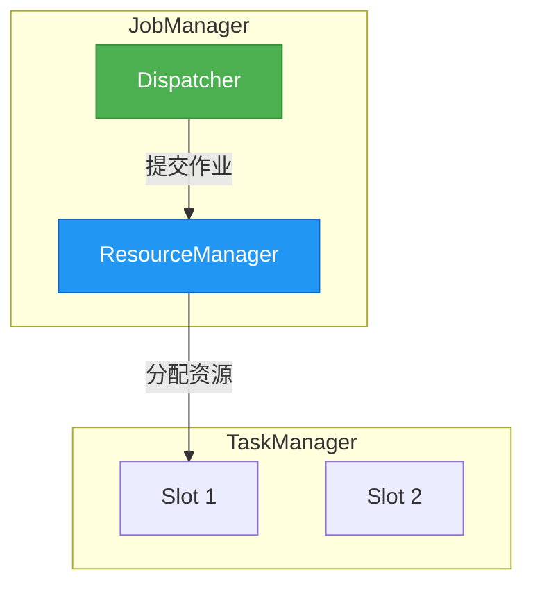
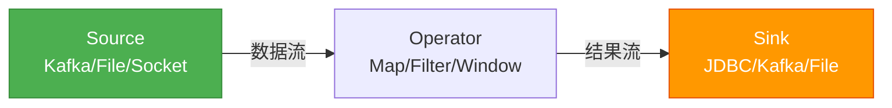
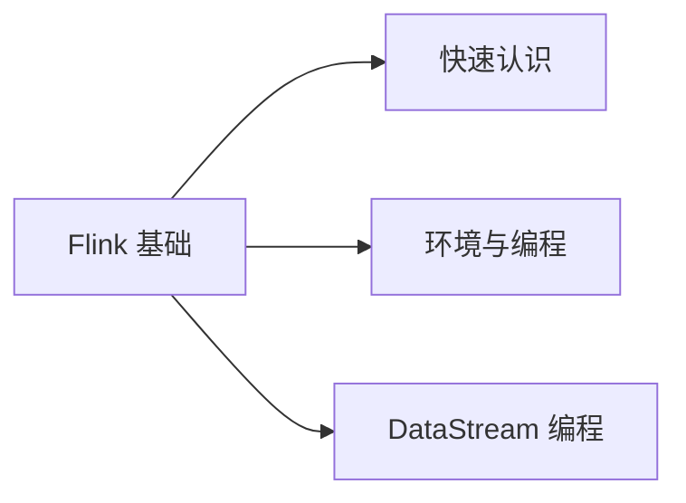

# Doc-to-Notes Reference

## Where to Add Diagrams (decision table)

`suggest_diagrams.py` flags these patterns automatically; this table is the manual
reference. **Add a diagram wherever the text describes a relationship, not just a fact.**

| Content pattern in text | Diagram type | Mermaid / format |
|---|---|---|
| 架构 / 组件 / 分层 / JobManager·TaskManager·Slot / Master-Slave | 分层架构图 | `graph TD` + `subgraph` per layer |
| 数据流向 / Source→Transform→Sink / 算子链 / 上游下游 | 数据流图 | `graph LR` with `\|label\|` edges |
| 流程 / 步骤 / 提交过程 / 启动过程 / 首先…然后 | 流程图 | `graph TD`, decisions as `{条件?}` |
| 时序 / 交互 / watermark / 窗口触发 / 握手 | 时序图 | `sequenceDiagram` |
| 状态 / 生命周期 / checkpoint / RUNNING→FINISHED | 状态机 | `stateDiagram-v2` |
| 分为 / 包括 / 种类 / 划分为 (分类陈列) | 分类树 或 HTML 卡片 | `graph LR` tree, or multi-panel HTML card |
| 对比 / 区别 / 批 vs 流 / 有界 vs 无界 | 对比 | Markdown table, or 2 side-by-side subgraphs |
| 概念总览 / 知识体系 / 多模块陈列 | 总览卡片 | HTML/CSS card (NOT Mermaid) |

**Rule of thumb**: 有方向的拓扑 → Mermaid；无方向的陈列/矩阵 → HTML 卡片；精确查找 → 表格；数学公式 → LaTeX。
Aim for **≥1 diagram per chapter file**; a chapter with an architecture/flow concept and
no diagram is incomplete.

> **典型误判**：原文"七大模块 / N 层架构"的**彩色分区图**——❌ 不要画 `ROOT-->M1-->M1A`
> 的 Mermaid 树（dagre 自动布局会乱、丑、节点挤成一团），✅ 用 **HTML 卡片**。只有当层与层
> 之间**有数据流/调用箭头**时才用 Mermaid。"分区陈列"用卡片，"动态拓扑"用 Mermaid。

---

## Code Language Mapping (single-cell table first line → fence)

The extractor maps a code block's first-line label to a fence language. Known labels:
`Shell/Bash/sh→bash` · `YAML/yml→yaml` · `Plain Text/text→text` · `SQL/MySQL/FlinkSQL→sql` ·
`Java→java` · `Scala→scala` · `Python→python` · `JSON→json` · `XML→xml` ·
`Properties/conf→properties/ini` · `Dockerfile→dockerfile`. Unlabeled code-looking cells
become ` ```text `. When writing notes, **fix obviously-wrong language tags** if the body
clearly belongs to another language (e.g. a `text` block that is actually Java).

---

## Frontmatter Template

```yaml
---
title: "[章节标题]"
source_doc: "[原始文件名]"
source_version: "Flink 1.15"  # 文档中提到的版本
current_version: "Flink 1.20" # 当前最新版
tags:
  - flink
  - big-data
  - streaming
date: 2026-01-01
---
```

---

## Version Re-baseline Patterns (latest-first)

**Core principle**: the body teaches the **latest stable version** as the main line —
concepts, terminology, API, config, recommended practice all reflect today's official docs.
The old version is demoted to a secondary migration note, never the subject of the main
prose. Don't write "原来这样 → 现在变了"; write "（最新版）这样做" and, *if useful*, append a
collapsible "旧版怎么写、为何变".

**❌ Old-anchored (don't do this):**
```markdown
### 生成 Watermark
旧版用 `BoundedOutOfOrdernessTimestampExtractor` 来分配时间戳……（大段讲旧 API）
> [!WARNING] 该类在新版已移除，请改用 WatermarkStrategy。
```

**✅ Latest-first (do this):**
```markdown
### 生成 Watermark
通过 `WatermarkStrategy.forBoundedOutOfOrderness(...)` 提取事件时间并生成 Watermark：
```java
stream.assignTimestampsAndWatermarks(
    WatermarkStrategy.<T>forBoundedOutOfOrderness(Duration.ofSeconds(5))
        .withTimestampAssigner((e, ts) -> e.eventTime));
```
> [!WARNING]- 旧版（1.x）写法
> 1.x 用 `BoundedOutOfOrdernessTimestampExtractor`（继承抽象类、重写 `extractTimestamp`）。
> 自 1.11 起被 `WatermarkStrategy` 取代、并在 2.0 移除——遇到旧代码时按上面的新写法迁移即可。
```

**Callout roles in latest-first mode:**

```markdown
> [!WARNING]- 旧版（X.Y）写法
> 旧 API/机制是什么、从哪个版本起被取代、迁移到新写法的要点。（折叠，作为迁移参考）

> [!INFO] 新特性（A.B+）
> 原文档没有、但新版新增且与本节相关的能力，简述用途。

> [!TIP] 推荐做法
> 当"能跑的最简新 API"与"官方推荐做法"不同时，点明生产环境推荐怎么做。
```

> 术语也要换：若新版重命名了概念（如配置项、模块名、角色名），正文一律用新名，旧名只在
> 迁移提示里出现一次（"旧称 X，现称 Y"）。

---

## 数学公式 (LaTeX / MathJax)

Obsidian 内置 MathJax，**数学公式一律用 LaTeX 渲染，绝不截图嵌入、不塞代码块**。
深度学习 / Transformer 类文档公式密集（attention、softmax、位置编码、LayerNorm），这是质量核心。

| 形式 | 语法 | 用途 |
|---|---|---|
| 行内公式 | `$ ... $` | 夹在文字中的符号，如"维度 $d_k$ 决定缩放因子" |
| 独立公式 | `$$ ... $$`（独占整行，前后留空行） | 重要公式单独成式 |

**常见公式写法（直接参考，照抄改）**：

- 缩放点积注意力（Scaled Dot-Product Attention）：
  ```
  $$
  \text{Attention}(Q,K,V)=\text{softmax}\!\left(\frac{QK^{\top}}{\sqrt{d_k}}\right)V
  $$
  ```
- 多头注意力：`$$\text{MultiHead}(Q,K,V)=\text{Concat}(\text{head}_1,\dots,\text{head}_h)W^O$$`
- 位置编码（Positional Encoding）：
  ```
  $$
  PE_{(pos,2i)}=\sin\!\left(\frac{pos}{10000^{2i/d_{model}}}\right),\quad
  PE_{(pos,2i+1)}=\cos\!\left(\frac{pos}{10000^{2i/d_{model}}}\right)
  $$
  ```
- LayerNorm：`$$\text{LayerNorm}(x)=\gamma\odot\dfrac{x-\mu}{\sqrt{\sigma^2+\epsilon}}+\beta$$`

**规则**：
- 从**公式截图**转写时（`manifest.json` 里 `small_inline:true` 的小图常是公式），先 Read 图
  核对每个符号 / 上标 / 下标 / 希腊字母，OCR 对公式不可靠。
- 多行公式用 `\\` 换行 + `aligned` 环境：`$$\begin{aligned} a&=b\\ c&=d \end{aligned}$$`；
  公式里**没有** `<br/>` 的概念（`<br/>` 是 Markdown 换行，不是 LaTeX 语法，别混用）。
- 行内用单 `$`，块级用双 `$$` 且独占一行、前后空行，否则 Obsidian 可能不渲染。

---

## Mermaid Rules (Strict)

> ⚠️ All rules below are hard requirements — violating them causes Obsidian render failures.

### When to Use Mermaid vs HTML Cards

| Content type | Tool |
|---|---|
| Architecture / flow / steps / sequence | Mermaid |
| Multi-panel overview / feature matrix | HTML card (see below) |
| Comparison table | Markdown table |

### Mermaid Checklist
- ❌ No `\n` in node labels — use `<br/>` only
  ```
  ❌  A["Line1\nLine2"]
  ✅  A["Line1<br/>Line2"]
  ```
- ❌ No Unicode arrows (`→ ← ↑ ↓`) inside node labels — use `->`/`to`/`then`
- ❌ No pipe labels with quotes: `-->|"label"|` → `-->|label|`
- ❌ No ASCII `()` inside node labels — use `（）` or `[]`
- ❌ No cyclic edges inside `subgraph`
- ⚠️ `mindmap` 谨慎使用：仅"总结 / 全文俯瞰"场景才用，且必须严格缩进（root 须缩进、每深一层 +2 空格、同级缩进完全一致），否则 Obsidian 报 "There can be only one root" 不渲染。栅栏写 ` ```mermaid `（非 ` ```mindmap `），`mindmap` 关键字顶格作第一行。**不确定能否渲染时降级为 `graph TD` 树**（根节点蓝色高亮 + 各章节作一级子节点、`-->` 连接），全版本稳定
- ❌ No `subgraph ID` as arrow endpoint — connect to nodes inside the subgraph
- ✅ Every `subgraph` must have matching `end`
- ✅ Arrows in `graph` should have `|label|` unless purely structural

### Color Palette

```
Start/entry:  fill:#4CAF50,stroke:#388E3C,color:#fff
Core concept: fill:#2196F3,stroke:#1565C0,color:#fff
Output/result:fill:#FF9800,stroke:#E65100,color:#fff
Warning/risk: fill:#f44336,stroke:#B71C1C,color:#fff
```

### Common Pattern: Architecture Diagram



### Common Pattern: Data Flow



---

## HTML Cards (Multi-Panel Overview)

**Rules:**
1. No blank lines inside HTML block (breaks Obsidian grid/flex)
2. All styles via inline `style=` only (no `<style>` tags)
3. No external URLs

**Template — Feature List Card:**

```html
<div style="display:flex; flex-direction:column; gap:10px; margin:1em 0;">
  <div style="background:#E3F2FD; border:2px solid #1565C0; border-radius:10px; padding:14px;">
    <div style="display:flex; align-items:baseline; gap:10px; margin-bottom:10px; flex-wrap:wrap;">
      <span style="font-weight:bold; color:#0D47A1; font-size:1.05em;">⚡ 核心特性一</span>
      <span style="color:#1565C0; font-size:0.85em;">副标题说明</span>
    </div>
    <div style="display:flex; flex-wrap:wrap; gap:8px;">
      <span style="background:#fff; border:1.5px solid #1565C0; color:#0D47A1; padding:6px 12px; border-radius:6px; font-size:0.9em;">特性标签1</span>
      <span style="background:#fff; border:1.5px solid #1565C0; color:#0D47A1; padding:6px 12px; border-radius:6px; font-size:0.9em;">特性标签2</span>
    </div>
  </div>
</div>
```

**7-color palette** (rotate per panel): 粉`#FCE4EC/#C2185B` · 橙`#FFF3E0/#E65100` · 黄绿`#F1F8E9/#558B2F` · 绿`#E8F5E9/#2E7D32` · 青`#E0F2F1/#00695C` · 蓝`#E3F2FD/#1565C0` · 紫`#F3E5F5/#6A1B9A`

---

## Callout Reference

| Type | Use case |
|---|---|
| `[!NOTE]` | Key concept / definition |
| `[!INFO]` | Version info / new feature note |
| `[!TIP]` | Best practice / pro tip |
| `[!WARNING]` | Deprecated API / breaking change |
| `[!QUESTION]` | Chapter-end exercise |
| `[!QUOTE]` | Core insight worth remembering |
| `[!EXAMPLE]` | Concrete use case / demo |
| `[!NOTE]-` | Collapsible detail (add `-` after type) |

---

## Chapter-End Exercise + Answer (mandatory)

Every chapter file ends with a `[!QUESTION]` callout **and** a collapsible
`[!SUCCESS]- 参考答案` callout that answers all of them. The answer block is collapsed
(`-` suffix) so the reader can self-test first, then expand to check.

### Format

```markdown
> [!QUESTION] 思考题
> 1. 问题一（针对本章核心概念，要求理解而非记忆）？
> 2. 问题二（对比 / 原理 / 踩坑类）？
> 3. 问题三（结合最新版本 API 的应用题）？

> [!SUCCESS]- 参考答案（先自己想，再点击展开）
> **1.** 先给结论。再讲为什么（机制 / 原理）。必要时附代码或指向上文小节。
>
> **2.** 同上：结论 → 原理 → 例证。对比题用小表格或「A 是……；B 是……」并列。
>
> **3.** 版本相关的答案必须与「版本说明」一致，给出**当前版本**的正确写法，不杜撰 API。
```

### Answer quality bar

- **完整**：每一问都答，不能只答一部分；多小问的题逐条 `**1.** **2.**` 编号对应。
- **正确且最新**：涉及 API 的答案必须与 Step 4 的版本调研一致；旧 API 在答案里要给新写法。
- **结论先行 + 讲透原理**：先一句话结论，再解释「为什么」，避免「看上文」式的空答案。
- **贴合本章**：问题与答案都只围绕本章真正讲过的内容，不引入本章未覆盖的概念。
- **可佐证**：合适时配最小代码片段、对比表，或指向上文具体小节（如「见 3.5.4」）。

### Worked example (Flink 窗口章节)

```markdown
> [!QUESTION] 思考题
> 1. 为什么 NonKeyed `windowAll` 的并行度只能是 1？能否调大并行度绕过？
> 2. 某个 Kafka 分区长期无数据时，EventTime 窗口的 Watermark 会怎样？如何避免？

> [!SUCCESS]- 参考答案（先自己想，再点击展开）
> **1.** 不能绕过。`windowAll` 没有 key，无法按 key 把数据分散到多个 subtask，所有数据必须
> 汇聚到同一个算子实例做全局聚合，因此 Window Operator 并行度被强制为 1。手动 `setParallelism(n)`
> 会被忽略。要并行就必须先 `keyBy()` 走 Keyed Window（见 3.1）。
>
> **2.** 该分区的 Watermark 会停滞，而下游取 `min(各分区 Watermark)`，于是整体 Watermark 被这个
> 空闲分区拖住，窗口迟迟不触发。解决：`WatermarkStrategy.withIdleness(Duration.ofMinutes(1))`
> 标记空闲分区，使其暂时退出 min 计算，让时间正常推进（见 3.5.3）。
```

---

## Code Block Standards

- Always specify language: ` ```java ` ` ```python ` ` ```yaml ` ` ```sql `
- Add `**📄 场景描述**` header above each code block
- Key lines get inline comment `// ← 说明`
- Long blocks (>25 lines): use `// --- section title ---` dividers
- Prefer Java/Python for self-authored examples (not Go)

### Code from screenshots (OCR + vision)

When code only exists as an image, `ocr_image.py` gives a text baseline (`ocr_text.json`),
but **never paste OCR output verbatim** — Apple Vision reliably mangles:
- Indentation (collapses leading spaces) → restore from the image
- `{ } ( ) ; →` and quotes → verify each against the image
- `l`/`1`/`I`, `O`/`0`, `;`/`:` confusions → fix in context
- Full-width vs half-width punctuation in Chinese comments

Workflow: read `ocr_text.json[file].text` as the skeleton, Read the image, then emit a
**corrected** code block. If `code_score` is high but the image is actually a UI screenshot
(toolbars, menus), treat it as UI (embed + `[!INFO]`), not code.

---

## Chapter File Quality Checklist

After writing each chapter file, verify:
```bash
wc -m <file>              # > 1000 chars
grep "^## " <file>        # subsections present
grep -c '```mermaid' <file>  # ≥ 1 diagram per chapter
grep -c '\[!WARNING\]' <file>  # version warnings if content has APIs
grep -c '!\[\](https://' <file>  # expect 0 (no external image URLs)
grep -c '\[!QUESTION\]' <file>   # ≥ 1 chapter-end exercise
grep -c '\[!SUCCESS\]' <file>    # ≥ 1 — every QUESTION must have an answer block
```

A chapter with `[!QUESTION] > 0` but `[!SUCCESS] == 0` is **incomplete** — the思考题
缺参考答案，必须补全后再交付。

Also confirm no leftover `<!-- FILL -->` placeholders remain:
```bash
grep -c '<!-- FILL -->' <file>   # expect 0
```

---

## Extracted JSON Schema

`extract_docx.py` emits `manifest.json` (full) and `chapter_NN.json` (one per chapter).
Section objects you'll consume when writing notes:

| `type` | Fields | Render as |
|---|---|---|
| `heading` | `level` (1-4), `text` | `#`/`##`/`###`/`####` |
| `paragraph` | `text` | prose (merge by theme) |
| `code` | `lang`, `text` (newlines preserved) | ` ```lang ` block |
| `list_item` | `ordered` (bool), `level` (indent), `text` | `-` or `1.` list, indented |
| `table` | `rows`, `cols`, `markdown` | the `markdown` string as-is |
| `quote` | `text` | `> [!NOTE]` callout (boxed prose) |
| `image` | `image_file`, `width`, `height`, `caption`, `duplicate?` | per Step 3 decision |

`chapter_NN.json` also has: `index`, `heading`, `parent` (breadcrumb), `section_count`,
and `headings` — the list of split-level titles folded into this file. When `headings` has
more than one entry the file is a **merge of small chapters**; name it after the `parent`
plus the title range (e.g. `headings: [1.1, 1.2, 1.3]` → `01-Flink入门概念.md`).

---

## Index File (`00-索引.md`) Template

```markdown
---
title: "[doc title] · 索引"
tags: [flink, big-data, moc]
date: <date>
---

# [doc title]

> [!INFO] 版本说明
> 本笔记以**当前最新稳定版 A.B** 为讲解主线（概念/API/配置/术语/推荐做法均为新版），原文档基于 X.Y；旧版差异以折叠的 [!WARNING] 迁移提示标注。

## 章节导航

1. [[01-离线批计算与流式计算]] — 批 vs 流的本质区别
2. [[02-Flink基本概念]] — 分布式有状态流处理框架
...

## 知识结构总览

> 📊 全文知识地图

```
