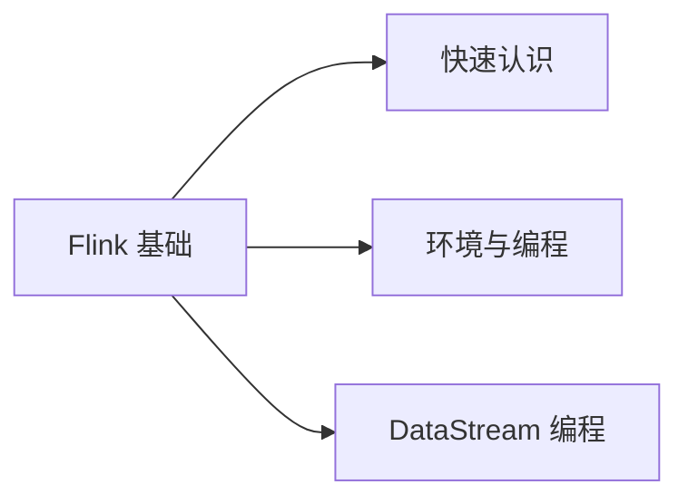

# 格式专属流程 · .docx / .doc / .pdf

本文件是 [SKILL.md](../SKILL.md) Step 0 路由到 `.docx`/`.doc`/`.pdf` 输入时的完整流程。
可视化规则见 [visualization.md](visualization.md)，核查脚本用法见 [verification.md](verification.md)，
数学公式规范见 [math-latex.md](math-latex.md)，时效性复查见 [freshness-check.md](freshness-check.md)。

## Prerequisites

`pip install python-docx oss2 pymupdf pillow ocrmac`
- pillow optional — image resize falls back to macOS `sips`
- ocrmac optional — code/UI screenshot OCR (Apple Vision); falls back to pytesseract

## A0 — Extract structure

> 🚨 **两个"拆分"是不同的东西，不要混为一谈：**
> - **提取分块**（`chapter_NN.json`）：只是给模型逐块读写用的**处理单元**，默认按 H2 拆，
>   服务于全局规则 1（Chunk everything）。
> - **成稿篇数**（输出几个 `.md`）：默认**单篇**——无论有几个 `chapter_NN.json`，都逐个
>   chapter 填进**同一个** `.md`；只有成稿 > 5 MB 才拆成多篇（见 A6d）。
>
> 因此"用户要一篇 md" **不等于**要加 `--no-split`。`--no-split` 会把全部内容塞进一个
> `chapter_01.json`，几百个 section 一次读不完（脚本会打 `[WARN]`），仅适用于总共
> ≤ 90 个 section 的小文档。

**推荐默认（适用所有文档类型，成稿仍为单篇 md）：**
```bash
source ~/.zprofile && python3 __SKILL_DIR__/scripts/extract_docx.py \
  "/path/to/document.docx"
```

写完 MD 后用 `wc -c` 检查**成稿 MD 大小**；**超过 5 MB** 时再按 H2 手动拆分（见 A6d）。适用于 `.docx` / `.doc` / `.pdf` 所有格式。

**极小文档（总 section ≤ 90）可选 `--no-split`**，省掉多个 chapter 文件：
```bash
source ~/.zprofile && python3 __SKILL_DIR__/scripts/extract_docx.py \
  "/path/to/document.docx" --no-split
```

> **PDF 提取的几个自动处理（无需手动干预，但要知道）**：
> - **阅读顺序**按版面从上到下、从左到右（`sort=True`），讲义里"正文层/卡片层/代码层"不再交错乱序。
> - **代码块**：等宽字体（Menlo/Consolas/…）为主的块输出为 `code`（保留换行与缩进，按内容猜
>   语言 java/yaml/json/bash/text；被版面拆开的同一段代码会自动接回）。写作时直接作 fenced
>   代码块使用，不要再从 paragraph 里拼代码。
> - **字形归一**：康熙部首等兼容字形（"⼯" → "工"）在提取时已折回常规汉字。
> - **截断检测**：引号/括号不配对的文本块标 `truncated: true`，并在 stderr 列出——写作处理见 A6b。

Handles `.docx`, `.doc` (auto-converts via `textutil`), and `.pdf`. Outputs to
`/tmp/doc_notes_<name>/`:
- `manifest.json` — full structure (headings, code, lists, tables, images w/ dimensions)
- `chapter_NN.json` — 默认按 H2 拆分每章一文件（处理单元）；`--no-split` 时全部内容写入单个 `chapter_01.json`
- `images/` — extracted images, resized to ≤2000px

Read the printed summary: title, chapter list, section-type counts. **Note the chapter
count** — you'll process exactly that many files.

## A0b — 变体：批量合并多个文档为一篇笔记

当用户给的是**同一批逻辑上属于一篇内容**的多个 `.pdf`/`.docx`/`.doc`（例如同一训练营某一周的
多节课件、同一课程的多讲 PPT），用 `extract_batch.py` 代替逐个跑 `extract_docx.py`，一次性合并成
**一份** `manifest.json` + `chapter_NN.json`：

```bash
# 目录模式：按文件名中第一个数字自动排序（"第2节"排在"第10节"前面，不会按字典序出错）
source ~/.zprofile && python3 __SKILL_DIR__/scripts/extract_batch.py \
  "/path/to/资料目录" --pattern "*.pdf" --title "Week1 导论"

# 显式文件列表模式：按给定顺序合并，不重新排序
source ~/.zprofile && python3 __SKILL_DIR__/scripts/extract_batch.py \
  file1.pdf file2.pdf file3.docx --title "Week1 导论"
```

- 每个源文件在合并结果里天然成为**一个 H2 章节**，也就是一个 `chapter_NN.json`；该文件内部原有的标题全部降到 H3/H4，
  不会与合成的 H2 抢章节边界。**合并成一篇 md 时也不要加 `--no-split`**：6 节课合进一个
  `chapter_01.json` 会有 700+ section，无法分块读写。正确做法是按 chapter 逐个读，逐个 H2 写进同一个 `.md`。
- **章节标题默认取文件名**（`--title-from filename`）：讲义/PPT 型 PDF 的封面大字通常是
  *标语*（如"工具太多不可怕，没有地图才可怕。"），真正的章节名在文件名里（"第4节：选型力：
  看懂 AI 编程工具的七层架构"）。需要用文档内 H1 时传 `--title-from heading`。
- 图片跨文件共享同一个编号序列和 `images/` 目录，不会互相覆盖。
- **输出格式与单文件模式完全一致**——A1 之后的所有步骤（图片上传、OCR、配图、写作、核验）
  不需要区分"这是合并出来的"还是"单文件跑出来的"，照常处理即可。
- 何时用：文件名带连续编号（第 N 节/讲/课）、内容主题连贯、体量都不大（讲义/PPT 型尤其常见）。
  超大型参考手册、内容彼此独立的文档，仍按单文件模式逐个处理。

## A1 — Decide output location

| Doc topic | Target |
|---|---|
| **Big data (Flink, Hadoop, Spark, Kafka, Hive, HBase, Zookeeper)** | `210_Dev_Stack/214_Big_Data/<Tech>/` |
| Middleware (Redis, RabbitMQ, Nginx, Dubbo, ES) | `210_Dev_Stack/213_Middleware/<Tech>/` |
| Language-specific (Java, Python) | `210_Dev_Stack/212_Java_Expert/` or `211_Python_Expert/` |
| Infra / ops (K8s, Docker, Linux) | `230_Infra_Ops/` |
| Platform course series (GeekTime etc.) | `260_Courses/` |
| Ambiguous | **ask the user** |

> **Big data lives in its own `214_Big_Data/`**, a sibling of `213_Middleware/` — not
> inside Middleware. Each technology gets its own sub-dir: `214_Big_Data/Flink/`,
> `214_Big_Data/Hadoop/`, `214_Big_Data/Spark/`, … New tech dirs are created as needed.

**落位决策流程（尤其适用于 A0b 合并出的课程系列笔记）：**
1. 先用 `find`/`ls` **只读**扫描目标知识库（如 `260_Courses/`），看有没有同训练营/同课程的现成
   子目录——命中就直接用，并说明理由。
2. 没命中、需要新建目录（如 `260_Courses/<训练营名>/Week1/`）时，**先在对话里提出建议路径并征得
   用户确认**，再创建目录/写入文件——新建目录、写入用户知识库属于会改变用户实际文件系统状态的
   操作，不能未经确认就自动执行（与本项目"低风险但仍需确认"的通用原则一致，不是例外）。
3. 新目录的命名沿用该知识库里 `260_Courses/`（或对应分类目录）已有的实际命名规律，不要凭空发明
   新规则。
4. **命中已有系列目录时**（目录里已有 `01-第一周-…`、`02-第二周-…` 这类同系列笔记），要做两件事：
   - **文件名**：沿用该系列的编号前缀和命名格式（例如下一篇就是 `03-第三周-<主题>.md`）。
   - **frontmatter / 写作风格**：先读一篇同系列笔记，对齐它的 frontmatter 字段、tag、callout 习惯。
   
   A7a 还要据此补全系列内的互链。

Output structure — 两种模式：

**单篇输出（推荐默认，与是否 `--no-split` 无关）：** 全部内容写入一个 `.md`，写完用 `wc -c` 检查**成稿 MD 大小**，**超过 5 MB** 才按 H2 手动拆分：
```
240_AI/AI大模型基础/
└── 01-AI大模型基础认知.md      # 全部章节合并在一个文件里（成稿 ≤ 5 MB 时保持单文件）
```

**多文件模式（超大型参考手册按需使用）：** one sub-dir per source doc, one `.md` per **top-level chapter**, plus an index:
```
214_Big_Data/Flink/01_Flink基础/
├── 00-索引.md                 # MOC: links every chapter in order
├── 01-快速认识Flink.md         # = H2 "1.快速认识flink"
├── 02-环境准备与编程入门.md      # = H2 "2.Flink环境准备和编程入门"
└── 03-DataStream编程基础.md    # = H2 "3.DataStream编程基础" (large → fill ### by ###)
```

## A2 — 判定文档类型（technical / conceptual），决定后续策略

提炼/配图/核查的力度因文档类型而异，**先判定并记下类型**，供 A4 / A5 / A7 复用：

| 类型 | 特征 | 典型 | 第一优先级 | 版本重对齐 | 核查阈值 |
|---|---|---|---|---|---|
| **technical** | 含代码/架构/配置/命令/API | Flink/Java/分布式/中间件 | 还原代码·图表·参数零失真 | 做（A4） | 散文 60% |
| **conceptual** | 通篇说理/概念/历史/数学原理，几乎无代码 | AI 发展史、Transformer 原理、设计模式、软技能 | 保叙述细节·论证链·公式·类比 | **跳过**（≈`--no-version-update`） | 散文 80% |

> 判定信号：有可提炼的代码/可跑的 API → technical；通篇"是什么/为什么/发展历程/数学推导" →
> conceptual；拿不准就按"原文是否存在可提炼的代码"二选一。该类型决定 A7
> `verify_content.py --type` 的取值，以及是否执行 A4 的版本重对齐。

> **讲义/PPT 型（正交于 technical/conceptual，二者都可能是讲义型）**：识别信号——
> `manifest.json` 里 `list_item` 占比明显偏高、段落普遍很短（标签墙/要点罗列多于连续段落）、
> 每页对应一个独立小概念。处理原则：**允许把简短要点适度扩写成完整解释句**（提炼+重组的应有之义），
> 但**每一项都要点名保留**，不能因为原文本来就短就一句话概括带过。配图优先级见
> [visualization.md](visualization.md) 的选型表：标签墙/工具清单 → HTML 卡片；"N 层架构"这类分层结构
> → Mermaid `subgraph` 分层图；方法论/概念间关系 → Mermaid 关系图。

> **课程项目型 technical（technical 的子类）**：识别信号——
> - 代码属于**课程配套的实战项目**，学员要跟着课程逐节搭建（如训练营里的 OryxOS）；
> - 原文常出现"本节交付物 / 验收 harness / 下一节接着做"之类的说法；
> - 代码里是项目自有的类名（`ProviderService`、`ReActLoop`…），不是在讲某个框架的用法。
>
> 这类文档的**主线是"项目怎么设计、为什么这样拆"**，框架 API 只是实现手段。处理原则：
> - **课程代码保持原样**（类名、方法签名、包结构都不改），否则笔记会和课程仓库、后续章节对不上；
> - A5 版本重对齐降级为"**旁注模式**"（见 A5）：框架 API 与当前稳定版不一致的地方，用 `[!WARNING]`
>   旁注写清新版写法，而不是把正文改写成新版。

> 🚨 **判定结果必须显式输出**（后续步骤强依赖此结论，不输出视为未完成本步）：
> ```
> 文档类型判定：technical / technical·课程项目型 / conceptual
> 理由：[1-2 句，说明判定依据]
> A5 版本重对齐：执行（正文改写）/ 执行（旁注模式）/ 跳过（原因：XXX）
> ```

## A3 — Upload images

```bash
source ~/.zprofile && python3 __SKILL_DIR__/scripts/upload_oss.py \
  /tmp/doc_notes_<name>/images/
```

Outputs `url_mapping.json` → `{filename: oss_url}`. Keyed by content md5 (idempotent —
safe to re-run, no duplicate uploads).

## A4 — Visually analyze images (OCR baseline + vision, batched ≤4)

**A4a — OCR baseline (script, one pass).** Run OCR over all images to get a text baseline
and a code-likelihood score per image:

```bash
source ~/.zprofile && python3 __SKILL_DIR__/scripts/ocr_image.py \
  /tmp/doc_notes_<name>/images/ --json
```

Outputs `ocr_text.json` → `{file: {text, code_score, code_like}}`. `code_like:true` (high
symbol density) flags likely **code / UI** screenshots vs diagrams.

**A4b — Vision + correction.** Images are NOT blindly embedded. For each image, Read it
(vision) AND consult its `ocr_text.json` entry, then decide (完整决策表见
[visualization.md](visualization.md#图片内容-可视化工具选型)):

| Image content | Action |
|---|---|
| Architecture / topology diagram | **Redraw as Mermaid** (don't embed) |
| Flow / sequence diagram | **Redraw as Mermaid** |
| **数学公式截图**（attention / softmax / 位置编码 / 求和符号等） | **转写为 LaTeX**：行内 `$...$`、独立成式 `$$...$$`（见 [math-latex.md](math-latex.md)）。**不要当图片嵌入、也不要塞进代码块** |
| Code screenshot | **Transcribe into a code block** — use OCR text as the baseline, then **fix indentation/symbols against the image** (OCR alone mangles `{} ; →` and indent) |
| Data / table screenshot | **Rebuild as a Markdown table** |
| 多分区陈列 / 总览信息图（≥3 并列彩色面板，无方向连接） | **重建为 HTML/CSS 卡片**（见 [visualization.md](visualization.md)），别用 Mermaid 硬画 |
| UI / config screenshot (operation demo) | **Embed OSS URL** + `[!INFO]` caption ≥3 sentences |
| Decorative / logo | Skip |

> Why both: Apple Vision OCR is fast and gives a text baseline, but errs on dense code;
> your vision Read corrects it. Two signals beat one, and you avoid re-typing long code.

> **`small_inline` 标注**：`manifest.json` 里 `small_inline:true` 的图（尺寸很小，
> 如 ≤700×150），多为**数学公式截图**或架构图的**局部组件标签**（如放大的 "Add & Norm"）。
> 优先：① 是公式 → 转 LaTeX；② 是组件标签 → 并入所属架构图的 Mermaid 节点，不要当独立图嵌入。
> A0 末尾会打印这类小图的数量。

⚠️ **Context control**: Read at most **4 images**, write a compact summary table
(filename · type · key info · decision), then read the next batch. This clears image
base64 from context and prevents request-body overflow.

## A5 — Re-baseline content to the latest version (unless `--no-version-update`)

🚨 **本步骤默认必做，跳过须满足明确条件之一：**
- A2 判定为 **conceptual**（通篇无可跑代码/API，如 AI 发展史、软技能、数学原理）
- 用户明确传入 `--no-version-update`

**其他情况一律执行本步，包括**：框架文档内有少量理论章节、文档版本只是较旧、"不确定该框架是否有版本差异"。判断不准时**必须问用户**，不能自行决定跳过。

**合法跳过时，输出中必须声明：**
> ⏭️ A5 已跳过（原因：conceptual 文档 / --no-version-update）

**执行时，必须按顺序完成以下三步，再进入 A6/A7（未完成不得推进）：**
1. 打印在文档中找到的原始版本（如 "Flink 1.15.3"）
2. 用 `WebSearch` 搜索最新稳定版，用 `WebFetch` 拉取官方功能文档页面（非 release notes）——打印所用的官方文档 URL，至少覆盖本文档的主要章节
3. 打印 re-baseline map（格式：`旧 → 新`，至少列出 5 条 API/配置/术语/推荐做法变更；若版本差异确实极小需附说明）

> **不执行上述三步就进入 A6 = 只做了格式转换，未做版本对齐，输出视为不合格。**

**官方文档抓取失败时的降级链（按顺序尝试，每一步都要把结果打印出来）：**

WebFetch 可能因为"无法验证域名安全性"、超时或 403 而失败（实测 `docs.spring.io` 就被拦过）。
遇到失败不能直接放弃，要依次尝试：

1. **换同站其它入口**：官方 GitHub 仓库的文档源文件，比如 `raw.githubusercontent.com/<org>/<repo>/main/docs/...`、
   `gh api repos/<org>/<repo>/contents/<path>`，或者官方 reference 的另一个版本路径。
2. **Bash `curl -sL`** 拉页面（加 `-A "Mozilla/5.0"`），再用 `python3` 去掉 HTML 标签后阅读相关段落。
3. **WebSearch 结果摘要**：只用来**确认最新版本号**，**不能**拿它当 API 细节的依据。
4. **以上都失败**：如实标为"**版本重对齐未完成**"，然后：
   - 正文保持原文版本的写法，在文首加 `[!WARNING]`，写明原文基于的版本、当前稳定版本号（如果第 3 步拿到了）、
     未能核对的 API 清单（列出具体类和方法），以及"落地前请按锁定版本核对"；
   - **绝不**凭记忆写出"新版 API"；
   - A7f 的 checklist 里这一项标为 `⚠️ 未完成`，并写明失败的 URL 和原因。

**旁注模式（A2 判定为"课程项目型 technical"时使用）**：上面三步照做，但 A6 的写法不同：
- 正文保留课程原代码；
- 只在用到框架 API 的地方（如 Spring AI 的 `ChatModel.call`、工具注解）加 `[!WARNING]- 当前稳定版 X.Y 写法` 的折叠旁注；
- re-baseline map 照常打印，作为旁注的依据。

**The latest stable version is the PRIMARY teaching baseline — not the doc's old version.**
The notes explain every concept, term, API, config, and recommended practice as it works in
the *current* stable release. The source doc's version survives only as **migration hints**
for a reader who might still meet old code. This is a re-write to the new version, not a set
of warnings bolted onto the old narrative.

1. **Find the doc's version** in the manifest text (e.g. "Flink 1.15", "flink-1.15.3").
2. **Pin the latest stable version**: `WebSearch` it, then `WebFetch` the **official current
   docs** (the actual feature pages, not just release notes) for the features each chapter
   covers. You are rewriting *to* this version, so you must read how today's docs actually
   present these features — never rely on memory, never invent APIs/behavior/defaults.
3. **Build a re-baseline map** per feature: old → current for API names, class/method names,
   config keys, **terminology**, changed defaults, removed/added mechanisms — plus the
   current *recommended* approach (which may differ from both the old way and the minimal new
   API). If the new version deprecated a mechanism and recommends a different one, the
   recommended one is what the chapter teaches as its main line.
4. This map drives A6: the body is written in the latest version's voice; the old version
   appears only as `[!WARNING]`-flagged migration notes. Genuinely new features the doc never
   covered may be added as brief `[!INFO]` notes where relevant.

> Skip this entire re-baseline only when invoked with `--no-version-update`, which keeps the
> notes faithful to the doc's original version. Re-baseline 写法范式（latest-first vs
> old-anchored 的对比示例）见本文件末尾的 "Version Re-baseline Patterns"。

## A5b — Find where diagrams help

```bash
python3 __SKILL_DIR__/scripts/suggest_diagrams.py \
  /tmp/doc_notes_<name>/chapter_NN.json
```

Prints per-chapter suggestions: which sections describe architecture / flow / state /
comparison / hierarchy, and the matching diagram type + scaffold. Use as hints — you
draw one diagram per concept（规则与模板见 [visualization.md](visualization.md)）。

> **配图密度**：每个**一级章节（H2）至少配 1 张图**（Mermaid 优先）。凡是描述"关系"的
> 地方都该有图——流程、架构、分层、对比、时间线、决策。**单文件模式不要因为是一个文件就
> 只画一两张图**：按 H2 章节数来保证覆盖。源文档里的示意图（决策树、结构图、流程图、关系图）
> 一律**重绘为 Mermaid**（见 A4 决策表），只有坐标图/散点图/真实截图这类 Mermaid 画不出
> 的才上传 OSS 嵌入。

## A6 — Write each chapter file (skeleton → fill, ONE chapter at a time)

> **写前先登记"关键内容元素"（防节内细粒度流失）。** 章节不漏 ≠ 内容不漏——叙述型文档
> 的丢失常发生在节内。开写前快速扫一遍该 chapter 的 sections，登记这几类高价值元素，
> 写作时逐一落实、A7 用脚本机械复验：
> - **数据 / 数字**：所有具体数值及语境（如"768 维""12 层""6 个 Encoder 堆叠"）。
> - **"N 个 X"结构**：作者归纳的"三大要素 / 四个步骤"——每项都要**单独展开**，不能只点名。
> - **并列长枚举**（≥5 项）：以列表 / 表格**逐项保留**，不得压成一句概述。
> - **关键类比 / 桥接逻辑**：解释抽象概念的类比、连接论点的因果句，**不得省略**。

Loop over `chapter_01.json … chapter_NN.json`. For each:

**A6a — Skeleton** (single Write, fast): frontmatter + version callout + `###` headings
with `<!-- FILL -->` placeholders. Use the chapter's `parent` field for the breadcrumb.

> **单篇输出的骨架**：整个文档只产出一个 `.md`，所以骨架是
> **一份 frontmatter + 所有 H2 章节（`##`）+ 每个章节下的 `###` 小节**，每个小节一个
> `<!-- FILL -->` 占位。骨架可能很长（如 25 个 H2），这没问题——随后仍是**逐个 `###`
> 一次 Edit 填充**，绝不一次写完整篇。所有 `chapter_NN.json` 的 `sections` 里的 `heading`
> 都要在骨架中出现，一个不漏。填充时**每次只读当前要写的那个 `chapter_NN.json`**，不要
> 把整个 manifest 读进上下文，也不要另外把全文导出成 txt 再读。

```markdown
---
title: "[chapter heading]"
source_doc: "[original filename]"
source_version: "Flink 1.15"
current_version: "Flink 1.20"
tags: [flink, big-data, streaming]
date: <date +%Y-%m-%d>
---

> 所属章节：[[00-索引]] · 上级：[parent]

> [!INFO] 版本说明
> 本笔记已按**当前最新稳定版 A.B** 重新梳理讲解（概念、API、配置、术语、推荐做法均为新版）；原文档基于 X.Y。旧版差异以 [!WARNING] 迁移提示标注。

## [subsection] 
<!-- FILL -->
```

**A6b — Fill** (one Edit per `###` section): replace each `<!-- FILL -->` with structured
content written **in the latest version's voice** (per A5's re-baseline map). The old
version is never the main subject — the current stable release is.

> **例外**：
> - A2 判定为**课程项目型 technical** 时，走 A5 的旁注模式：课程代码原样保留，新版差异只写在折叠的 `[!WARNING]` 里，下面几条"按新版改写"的要求不适用于项目自有代码；
> - A5 **降级失败**（版本重对齐未完成）时同理：保留原文写法，只加文首警告。

- **Concepts, terminology, recommended practice** follow today's official docs. If the new
  version deprecated a mechanism and recommends another, teach the **new mechanism as the
  main line** — don't explain the old mechanism then bolt on a warning.
- **Code / config / class & method names** are the current version's. Write the current API
  as the primary example; do **not** paste the doc's old API verbatim and merely warn after.
- **Old version → migration note only**: where a reader might still meet old code, add a
  short, ideally collapsible `[!WARNING]- 旧版（X.Y）写法` note saying what it was and why it
  changed. Keep it secondary to the main narrative.
- Merge paragraphs by theme, insert Mermaid/code/tables/callouts, embed image URLs from
  `url_mapping.json`. **One section per Edit**, in order.
- **换行**：全文任何位置（Mermaid 节点、表格单元格、callout、正文）一律用 `<br/>` 换行，绝不使用 `\n`（见 SKILL.md 顶部全局换行规则）。
- **`truncated: true` 的块（原文被版面或单元格截断）**：如 webhook payload 表里只剩 `{"msgtype":"text","`。
  - **能补全的**（有公开约定、官方文档，或同文其它位置有完整版）：可以补，但必须紧跟一个
    `[!NOTE] 原文截断说明`，写明哪些部分是补全的、依据是什么，并提示"字段以官方文档为准"；
  - **补不了的**：照原样保留截断内容，并标注"（原文截断）"；
  - **绝不**悄悄补全、当作原文呈现。
- **原文交付物/验收项分散在各处时**（讲义常见：交付物、验收 harness、拆解锚点等散落在不同页），
  可以在每个 H2 末尾归拢成一个 `[!NOTE] 本节交付物` callout，但每一项都要保留。

**代码语言转换规则（Scala → Java）**

源文档代码块语言为 `scala`（或 `scala/java`）时，**Java 为主线，Scala 降级为折叠注**：

```markdown
```java
// ① 主代码块：Java 等价实现（Java 8+ Stream/lambda/Flink Java API，不保留 Scala 语法）
```

> [!NOTE]- Scala 原版
> ```scala
> // ② 折叠：保留原文档的 Scala 代码
> ```
```

> 若源文档语言标注为 `scala/java`、或同时提供两版，以 Java 版为主，Scala 版折叠。
> Kotlin 代码同理：Java 为主（若存在等价写法），Kotlin 降级折叠。

> ⚠️ **版本对齐（与 A5 联动）**：转换后的 Java 代码必须使用 **A5 re-baseline map 中的最新 API**，
> 不是原 Scala 代码对应的旧版 API 的简单翻译。例如 Flink Scala 旧版用 `ExecutionEnvironment`，
> 转 Java 时要直接写当前版推荐的 `StreamExecutionEnvironment` + DataStream API，而不是翻译出
> 同样已废弃的 Java 旧写法。**先 re-baseline，再转语言**。

**Python 补充规则（Java / Scala / Kotlin → Python）**

每个实质性 `java` / `scala` / `kotlin` 代码块（含 Scala→Java 转换后的块）之后紧跟：

```markdown
> [!TIP]- Python 等价实现
> ```python
> # 使用官方 SDK（pyflink / pyspark / kafka-python 等），优先标准库
> ```
```

> ⚠️ **版本对齐（与 A5 联动）**：Python 代码同样基于**最新稳定版**的 Python SDK
> （如 PyFlink 当前版、PySpark 当前版）——不是对旧 Java 代码的逐行翻译，而是最新 Python 推荐写法。
> 需要时用 `WebSearch` 确认 Python SDK 的当前 API，不要凭记忆写旧接口。

**跳过条件**（不加 Python 块）：
- 单行 CLI 命令或环境检查（如 `ollama -v`、`mvn --version`）
- 纯配置片段（YAML / Properties / JSON / XML）
- 代码语言为 `bash` / `shell` / `sql` / `text`
- 不足 3 行的简短片段

> Python 块**不替换**主代码块，只是补充；主线叙述仍以原语言（Java）为准。

> Verify every re-baselined API/behavior against A5's fetched official docs before
> writing it. When unsure whether the new version changed something, fetch and confirm —
> never guess a "modern" API into existence.

**A6c — Chapter-end exercise WITH answers (mandatory).** End each chapter with a
`[!QUESTION]` callout (2–4 thinking questions) **immediately followed by a collapsible
`[!SUCCESS]- 参考答案` callout that answers every single question**. A question without a
reference answer is an incomplete chapter — never ship one.

The answers are the highest-value part of the note: they must be **complete, correct, and
current** (matching the latest version from A5), not one-line hand-waves. For each
question give the direct conclusion first, then the *why* (mechanism / principle), and
where useful a code snippet, a comparison, or a `file:line`-style pointer to the relevant
section above. Verify any version-specific API in the answer against A5's findings —
do **not** invent APIs. Match the questions to the chapter's actual content (don't ask
about something the chapter never covered). See [verification.md](verification.md) →
"Chapter-End Exercise + Answer" for the exact format and a worked example.

> **Large chapter (the script prints a heads-up, e.g. 256 sections):** this is normal and
> safe — the file is big but each Edit is small. Build the skeleton from its `###` (H3)
> headings, then fill **one `###` at a time**. If a single `###` is itself huge (many H4
> items, e.g. 50+ operators), fill it in **several Edits** (a few H4 items each) rather
> than one. Never write the whole chapter body in one call.

**A6d — 单篇输出：写完后检查大小**

```bash
wc -c "<out_dir>/01-文件名.md"   # 输出字节数
```

| 大小 | 处理方式 |
|---|---|
| ≤ 5,242,880 字节（5 MB） | 保持单文件，直接进 A7 |
| > 5 MB | 按 H2 标题拆分为多文件（参见下方说明） |

**超过 5 MB 时的拆分做法：**
1. 将当前单一 MD 文件重命名为 `_draft.md` 备份。
2. 在同一目录下新建多个章节文件（`01-xxx.md` `02-xxx.md` …），每个对应一个 H2 章节，沿用相同的 frontmatter 和 `[!QUESTION]/[!SUCCESS]` 结构。
3. 删除 `_draft.md`，补写 `00-索引.md` 链接所有章节文件。
4. 不重新运行 extract —— 内容已在草稿里，直接拆分复制即可。

## A7 — Index + 内容核验 + report

**A7a — 写索引**：Write `00-索引.md` — a MOC linking every chapter `[[NN-title]]` in order,
with a 1-line summary each, and a top-level Mermaid overview of the whole doc's structure.
（单篇输出可省略独立索引，改在文件顶部放一个目录式 Mermaid 总览。）

**A7a′ — 入链检查（必做，防孤立笔记）**：新笔记必须至少被一篇已有笔记链接，只链出去不算。
```bash
# 1. 找有没有笔记已经链接了新笔记（排除新笔记自身）
grep -rl "\[\[<新笔记文件名去掉.md>" "<知识库根>" | grep -v "<新笔记路径>"
# 2. 没有入链时，找同目录的系列笔记和课程索引页
ls "<out_dir>"; grep -rl "\[\[<上一篇文件名>" "<知识库根>" | head
```
- **同系列的上一篇**（如 `02-第二周-…`）：在它末尾的相关笔记或导航处追加 `[[新笔记]]`。这是小幅追加，可以直接做，完成后在报告里说明；
- **课程或目录索引页**（如 `260_Courses.md`、`00-索引.md`）里有该系列的列表时，按原格式追加一行；
- **全局主页或目录说明**（如 `HomePage.md`、`vault_map.md`）以及大幅改动：**先问用户**，不要直接改；
- 新笔记里也要链回上一篇和所属索引，形成双向链接。

**A7b — 内容守恒机械核验（必做，直击"整理后内容会不会丢失"）**：
```bash
python3 __SKILL_DIR__/scripts/verify_content.py \
  /tmp/doc_notes_<name>/manifest.json  <笔记.md 或笔记目录>  --type <technical|conceptual>
```
用法与输出解读见 [verification.md](verification.md#verify_contentpy)。

**A7c — Mermaid 语法检查（必做）**：

```bash
python3 __SKILL_DIR__/scripts/check_mermaid.py <笔记.md 或笔记目录>
```

错误码含义见 [verification.md](verification.md#check_mermaidpy)。

**A7d — 思考题答案核验**：
```bash
for f in <out_dir>/[0-9]*.md; do
  q=$(grep -c '\[!QUESTION\]' "$f"); a=$(grep -c '\[!SUCCESS\]' "$f")
  [ "$q" -gt 0 ] && [ "$a" -eq 0 ] && echo "⚠️  $f 有思考题但缺参考答案"
done
```

**A7e — 成稿外链可达性核验（必做，直击"图片无法显示"）**：
```bash
# 仅报告；发现不可达的 OSS 图，加 --images-dir 自动重传修复后复检
python3 __SKILL_DIR__/scripts/check_links.py <笔记.md 或笔记目录> \
  --images-dir /tmp/doc_notes_<name>/images
```
- 扫成稿 MD 里**真正引用的**所有 http(s) 图片/链接 URL，逐个 HTTP 回读，确认能正常展示。
  这是 A3 上传期校验之外的**最终防线**——能兜住手动拼的、外链的、漏网的 URL。
- **DOCX 来源**：`extract_docx.py` 已将 Word 内嵌超链接（`w:hyperlink`）提取为 `[text](url)` Markdown 格式，这些链接会一并被扫到并校验。
- 有 `[ERROR]` 时：给了 `--images-dir` 会自动调 `upload_oss.py` 全量重传修复再复检；
  仍不可达的需人工排查（OSS 公共读 / 防盗链 / 链接本身失效）。**必须修到 0 个不可达**。

**A7f — 完成报告**：先按以下格式输出自检 checklist，再附摘要。
```
## 质量核查结果
- [x] 内容守恒：verify_content RATIO=xx.x% PASS（type=xxx）；数字 0 处 MISSING，枚举 0 处 FLAG
- [x] Mermaid 语法：check_mermaid 0 ERROR，0 WARN
- [x] 章节无遗漏：原文 N 个 H2，笔记已覆盖 N 个
- [x] 配图充分：Mermaid N 个 + LaTeX 公式 M 处 + HTML 卡片 K 个（每个 H2 ≥1 图）
- [x] 思考题均有参考答案
- [x] 无 `\n` 换行、无残留 `<!-- FILL -->`
- [x] 版本重对齐：（technical）已完成，官方文档 URL: [列出至少1条] / （课程项目型）旁注模式已完成 / （conceptual / --no-version-update）已跳过，理由：[列出] / ⚠️ 未完成：[失败的 URL + 原因 + 已加文首 WARNING]
- [x] 截断内容：N 处 truncated，已补全 M 处（均有 [!NOTE] 声明）/ 无
- [x] 入链：已从 [[xxx]] 链入 / ⚠️ 待用户确认挂载位置
```
> 某项没做到就标 `⚠️`，并写清原因，不能为了好看一律打 `[x]`。
摘要：output dir、files created、图片处理统计（嵌入 / 重绘 Mermaid / 转 LaTeX / 转卡片）、
Mermaid 数量、版本差异（technical）或"概念类已跳过版本重对齐"（conceptual）、思考题数量。

## Arguments (extract_docx.py)

| Arg | Default | Description |
|---|---|---|
| `doc_path` | — | Absolute path to `.docx` / `.doc` / `.pdf` |
| `--output-dir` | `/tmp/doc_notes_<name>` | Override extraction output dir |
| `--max-img-px` | 2000 | Resize images larger than this (any side) |
| `--split-level` | `auto` | Chapter split level: `auto` / `2` / `3` |
| `--no-split` | off | 全部内容写入单个 `chapter_01.json`。**仅限总 section ≤ 90 的小文档**；它只影响提取分块，与成稿是否单篇 md 无关（超过 90 时脚本打 `[WARN]`）。 |
| `--min-sections` | 15 | Merge small same-parent chapters below this size (0 disables) |

## Arguments (extract_batch.py — A0b)

| Arg | Default | Description |
|---|---|---|
| `paths` | — | A directory (glob-scanned) **or** an explicit list of files (merged in the exact order given) |
| `--pattern` | match `.pdf`/`.docx`/`.doc` | Glob pattern, only used in directory mode |
| `--title` | dir name / first file's stem | Title of the merged document |
| `--title-from` | `filename` | 每个文件的 H2 章节标题来源：`filename`（默认）/ `heading`（用文档内 H1）/ `auto`（文件名含"第N节/讲/课"时用文件名，否则用 H1） |
| `--output-dir` | `/tmp/doc_notes_<title>` | Override extraction output dir |
| `--max-img-px` | 2000 | Same as `extract_docx.py` |
| `--split-level` | `auto` | Same as `extract_docx.py` |
| `--no-split` | off | Same as `extract_docx.py` |
| `--min-sections` | 15 | Same as `extract_docx.py` |

输出的 `manifest.json` / `chapter_NN.json` 与 `extract_docx.py` 单文件模式**同构**——每个源文件是一个
H2 章节，其余字段/结构完全一致，因此 A1 之后的流程无需区分来源。

## How chapters are split (one file per top-level chapter)

**默认（推荐）：按 H2 每章一个 `chapter_NN.json`。** A document's `1.` `2.` `3.`
headings are the natural units, so a typical doc becomes just **a few chunk files** (e.g. Flink
基础 → 3 files), not a swarm. Falls back to H1/H3 only when H2 is absent. These are
**processing chunks only** — the final note is still ONE `.md` by default (A6 fills every
chapter into it), split into several `.md` only when the note exceeds 5 MB (A6d) or for
huge reference manuals.

**`--no-split`：全部内容放进一个 `chapter_01.json`。** 仅适用于总 section ≤ 90 的小文档；
大文档用它会违反 Chunk everything（脚本打 `[WARN]`）。

> **A large chapter is NOT auto-split.** The 120s timeout limits a single Edit, not a file.
> A big chapter (e.g. 256 sections) is written safely via **skeleton → per-`###` Edit fill**.
> The script prints a heads-up for oversized chapters; only if one is unwieldy, re-run that
> doc with `--split-level 3` to break it up.

- `--no-split` — 单个 chunk 文件（仅小文档）。
- `--split-level 2` (default auto) / `3` — force coarser or finer.
- `--min-sections 15` — if you ever opt into H3 splitting, small same-parent chapters merge
  (carrying a `headings` list like `1.1` `1.2` `1.3`) so you don't get tiny files.

A "section" = one heading / paragraph / code block / list item / table / image (not words).
Content is conserved exactly across all chapter files (nothing dropped or duplicated).

## Batch processing

Two different needs, two different tools — pick based on whether the files should become
**one note** or **stay separate notes**:

- **One note per file** (files are independent topics): loop `extract_docx.py` as before.
  ```bash
  for f in "/path/to/资料"/*.docx; do
    [[ "$f" == *"(1).docx" ]] && continue   # skip duplicate copies
    python3 .../extract_docx.py "$f"
  done
  ```
- **One merged note for the whole batch** (files are chapters of one logical document, e.g.
  a course week's several lecture PDFs): use `extract_batch.py` instead — see A0b.

## Edge cases & compatibility

| Situation | Handling |
|---|---|
| `.doc` (legacy binary) | Auto-converted to `.docx` via `textutil` (macOS); else asks user to convert |
| Code in single-cell tables (多易 style) | Detected → code block with language from first line |
| Code as monospace paragraphs (other vendors) | Detected by font name → code block |
| No font-size headings (structure via numbering) | Falls back to `1.`/`1.1` numbering depth |
| No H2 chapters at all | Splits at H1, then H3; if none, single file (warns) |
| Huge chapter (>90 sections) | `auto` split drops to H3 for manageable files |
| Image > 2000px | Auto-resized before upload & visual analysis |
| Duplicate image in doc | Deduped (md5) — uploaded once |
| PDF prose fragmented | Spans merged per block, not per span; CJK-aware line joining (no "只翻 译") |
| PDF reading order scrambled (prose / card / code layers interleaved) | Blocks read with `sort=True` (top→bottom, left→right) |
| PDF code listing (monospace font, e.g. Menlo) | → `code` section, newlines/indent kept, language guessed; CJK comment soft-wraps re-joined; split listings merged |
| Prose that merely starts with a monospace term (`Profile：一个…`) | Kept as paragraph (CJK punctuation outside comments/strings ⇒ prose) |
| PDF Kangxi-radical glyphs ("⼯" U+2F2F) | Folded to normal ideographs at extraction; `verify_content.py` also folds both sides |
| Text clipped by slide/table cell (`{"msgtype":"text","`) | Tagged `truncated: true` + listed on stderr → disclose in note (A6b) |
| Image embedded in table cell | Extracted as image, not lost |
| Code only exists as a screenshot | OCR baseline (`ocr_image.py`) + vision correction → code block |
| Scanned PDF (no text layer) | `extract_docx.py` yields few sections; run `ocr_image.py` on page images |
| PDF page number ("2 / 10") | Filtered out during extraction, never becomes a section |
| PDF header/footer repeated on ≥3 pages | Kept only on first occurrence, rest dropped as watermark noise |
| Tag-cloud / tool-list slide (≥3 short unpunctuated blocks, same page) | Reclassified to `list_item` so it's written & verified as one list, not scattered paragraphs |
| Several related files (course week, lecture series) | Use `extract_batch.py` (A0b) to merge into one manifest/note instead of one-per-file — **without** `--no-split` |
| WebFetch blocked for official docs | A5 fallback chain (other entry → `curl` → search for version only) → else mark "未完成" + top `[!WARNING]` |
| Output dir already holds a series (`01-…`, `02-…`) | Follow series naming/frontmatter (A1), add inbound link from previous note (A7a′) |

## Extracted JSON Schema

`extract_docx.py` emits `manifest.json` (full) and `chapter_NN.json` (one per chapter).
Section objects you'll consume when writing notes:

| `type` | Fields | Render as |
|---|---|---|
| `heading` | `level` (1-4), `text` | `#`/`##`/`###`/`####` |
| `paragraph` | `text` | prose (merge by theme) |
| `code` | `lang`, `text` (newlines preserved) | ` ```lang ` block |
| `list_item` | `ordered` (bool), `level` (indent), `text` | `-` or `1.` list, indented |
| `table` | `rows`, `cols`, `markdown` | the `markdown` string as-is |
| `quote` | `text` | `> [!NOTE]` callout (boxed prose) |
| `image` | `image_file`, `width`, `height`, `caption`, `duplicate?` | per A4 decision |

`chapter_NN.json` also has: `index`, `heading`, `parent` (breadcrumb), `section_count`,
and `headings` — the list of split-level titles folded into this file. When `headings` has
more than one entry the file is a **merge of small chapters**; name it after the `parent`
plus the title range (e.g. `headings: [1.1, 1.2, 1.3]` → `01-Flink入门概念.md`).

## Code Language Mapping (single-cell table first line → fence)

The extractor maps a code block's first-line label to a fence language. Known labels:
`Shell/Bash/sh→bash` · `YAML/yml→yaml` · `Plain Text/text→text` · `SQL/MySQL/FlinkSQL→sql` ·
`Java→java` · `Scala→scala` · `Python→python` · `JSON→json` · `XML→xml` ·
`Properties/conf→properties/ini` · `Dockerfile→dockerfile`. Unlabeled code-looking cells
become ` ```text `. When writing notes, **fix obviously-wrong language tags** if the body
clearly belongs to another language (e.g. a `text` block that is actually Java).

## Index File (`00-索引.md`) Template

```markdown
---
title: "[doc title] · 索引"
tags: [flink, big-data, moc]
date: <date>
---

# [doc title]

> [!INFO] 版本说明
> 本笔记以**当前最新稳定版 A.B** 为讲解主线（概念/API/配置/术语/推荐做法均为新版），原文档基于 X.Y；旧版差异以折叠的 [!WARNING] 迁移提示标注。

## 章节导航

1. [[01-离线批计算与流式计算]] — 批 vs 流的本质区别
2. [[02-Flink基本概念]] — 分布式有状态流处理框架
...

## 知识结构总览

> 📊 全文知识地图

```

## Version Re-baseline Patterns (latest-first)

**Core principle**: the body teaches the **latest stable version** as the main line —
concepts, terminology, API, config, recommended practice all reflect today's official docs.
The old version is demoted to a secondary migration note, never the subject of the main
prose. Don't write "原来这样 → 现在变了"; write "（最新版）这样做" and, *if useful*, append a
collapsible "旧版怎么写、为何变".

**❌ Old-anchored (don't do this):**
```markdown
### 生成 Watermark
旧版用 `BoundedOutOfOrdernessTimestampExtractor` 来分配时间戳……（大段讲旧 API）
> [!WARNING] 该类在新版已移除，请改用 WatermarkStrategy。
```

**✅ Latest-first (do this):**
```markdown
### 生成 Watermark
通过 `WatermarkStrategy.forBoundedOutOfOrderness(...)` 提取事件时间并生成 Watermark：
```java
stream.assignTimestampsAndWatermarks(
    WatermarkStrategy.<T>forBoundedOutOfOrderness(Duration.ofSeconds(5))
        .withTimestampAssigner((e, ts) -> e.eventTime));
```
> [!WARNING]- 旧版（1.x）写法
> 1.x 用 `BoundedOutOfOrdernessTimestampExtractor`（继承抽象类、重写 `extractTimestamp`）。
> 自 1.11 起被 `WatermarkStrategy` 取代、并在 2.0 移除——遇到旧代码时按上面的新写法迁移即可。
```

**Callout roles in latest-first mode:**

```markdown
> [!WARNING]- 旧版（X.Y）写法
> 旧 API/机制是什么、从哪个版本起被取代、迁移到新写法的要点。（折叠，作为迁移参考）

> [!INFO] 新特性（A.B+）
> 原文档没有、但新版新增且与本节相关的能力，简述用途。

> [!TIP] 推荐做法
> 当"能跑的最简新 API"与"官方推荐做法"不同时，点明生产环境推荐怎么做。
```

> 术语也要换：若新版重命名了概念（如配置项、模块名、角色名），正文一律用新名，旧名只在
> 迁移提示里出现一次（"旧称 X，现称 Y"）。

## Code Block Standards

- Always specify language: ` ```java ` ` ```python ` ` ```yaml ` ` ```sql `
- Add `**📄 场景描述**` header above each code block
- Key lines get inline comment `// ← 说明`
- Long blocks (>25 lines): use `// --- section title ---` dividers
- Prefer Java/Python for self-authored examples (not Go)

### Code from screenshots (OCR + vision)

When code only exists as an image, `ocr_image.py` gives a text baseline (`ocr_text.json`),
but **never paste OCR output verbatim** — Apple Vision reliably mangles:
- Indentation (collapses leading spaces) → restore from the image
- `{ } ( ) ; →` and quotes → verify each against the image
- `l`/`1`/`I`, `O`/`0`, `;`/`:` confusions → fix in context
- Full-width vs half-width punctuation in Chinese comments

Workflow: read `ocr_text.json[file].text` as the skeleton, Read the image, then emit a
**corrected** code block. If `code_score` is high but the image is actually a UI screenshot
(toolbars, menus), treat it as UI (embed + `[!INFO]`), not code.
