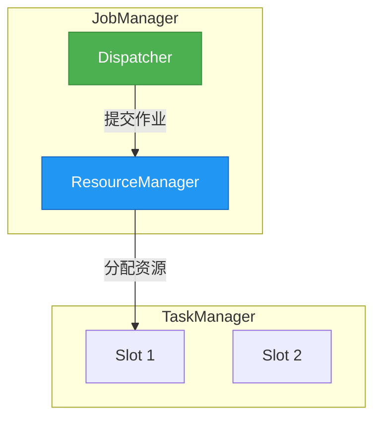
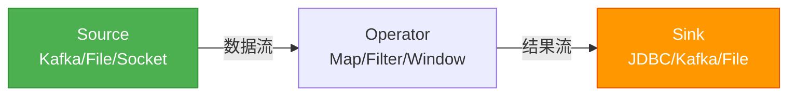

# 可视化规则（Mermaid + HTML/CSS 卡片）

两种格式（docx/pdf、mhtml）及未来格式共用本文件的规则。核心判断只有一条：
**有方向的拓扑 → Mermaid；无方向的陈列/矩阵 → HTML 卡片；精确查找 → 表格；数学公式 → LaTeX**
（LaTeX 规则见 [math-latex.md](math-latex.md)，仅 docx/pdf 路径常用）。

## 可视化模式选型表

| 内容形态 | 工具 | 典型场景 |
|---|---|---|
| 多分区**陈列**（≥3 并列面板，无方向连接） | **HTML 卡片** | 课程七大部分、五层架构总览、方法论矩阵、知识体系 |
| **层级**结构（有上下父子关系，节点 ≤6） | Mermaid `graph TD` + subgraph | 系统三层模型、调用栈 |
| **流程 / 链路 / 步骤** | Mermaid `graph TD/LR` | 请求处理流程、CI/CD 流水线 |
| **时序 / 交互** | Mermaid `sequenceDiagram` | OAuth 握手、RPC 调用 |
| **状态 / 生命周期** | Mermaid `stateDiagram-v2` | 订单状态机、连接生命周期 |
| **决策树 / 选型** | Mermaid `graph TD` + 菱形 | "什么时候用 X / Y" |
| **思维导图 / 全文俯瞰** | Mermaid `mindmap` | 总结章节 |
| **属性对比 / 参数速查** | Markdown 表格 | 方案对比表、配置参数 |
| **目录 / 文件树** | plain code block | 工程目录结构 |

**文本模式 → 图表类型对照**（写作时看到这些文字线索，主动配图，不必等原文有截图）：

| 文中出现的模式 | 诊断图 | Mermaid / 格式 |
|---|---|---|
| 架构 / 组件 / 分层 / JobManager·TaskManager·Slot / Master-Slave | 分层架构图 | `graph TD` + `subgraph` per layer |
| 数据流向 / Source→Transform→Sink / 算子链 / 上游下游 | 数据流图 | `graph LR` with `\|label\|` edges |
| 流程 / 步骤 / 提交过程 / 启动过程 / 首先…然后 | 流程图 | `graph TD`, decisions as `{条件?}` |
| 时序 / 交互 / watermark / 窗口触发 / 握手 | 时序图 | `sequenceDiagram` |
| 状态 / 生命周期 / checkpoint / RUNNING→FINISHED | 状态机 | `stateDiagram-v2` |
| 分为 / 包括 / 种类 / 划分为（分类陈列） | 分类树 或 HTML 卡片 | `graph LR` tree, or multi-panel HTML card |
| 对比 / 区别 / 批 vs 流 / 有界 vs 无界 | 对比 | Markdown table, or 2 side-by-side subgraphs |
| 概念总览 / 知识体系 / 多模块陈列 | 总览卡片 | HTML/CSS card（**不要**用 Mermaid） |

**典型误判**：原文"七大模块 / N 层架构 / 五层架构总览"的**彩色分区图**——❌ 不要画
`ROOT --> M1 --> M1A` 的 Mermaid 树（dagre 自动布局会乱、丑、节点挤成一团），✅ 用 **HTML 卡片**。
只有当层与层之间**有数据流/调用箭头**时才用 Mermaid。"分区陈列"用卡片，"动态拓扑"用 Mermaid。

**配图密度**：docx/pdf 路径每个一级章节（H2）至少配 1 张图；mhtml 路径每篇笔记至少 2 个可视化块
（含总结章节的 1 个 mindmap），`conceptual` 类可视化降为辅助（见各自 reference 文件的数量下限说明）。

## HTML/CSS 卡片（用于多分区信息图）

**为什么用 HTML 而不是 Mermaid**：Mermaid 是 dagre 自动布局，节点位置由算法决定，做不出"卡片矩阵+色面板+整齐对齐"的设计感。HTML+inline CSS 完全可控，且 Obsidian 原生渲染，无需任何插件。

**🚨 铁律 1：HTML 块内禁止出现空行**
Obsidian 的 markdown 处理器看到空行会把后面的 `<div>` 包进新的 `<p>`，**直接破坏 CSS Grid / Flex 的父子关系**，导致 grid 退化成单列、flex 间距错乱。所有 `<div>` 之间**不能有任何空行**，整个卡片块必须是连续的一整段 HTML。

**铁律 2：只用 inline `style=` 属性**
不要在笔记里引入 `<style>` 标签或外部 CSS——Obsidian 会过滤。所有样式必须写在 `style=` 内联属性中。

**铁律 3：禁止外部资源**
HTML 卡片不得引用任何外部 URL（图片、字体、JS）。

**🚨 铁律 4：HTML 卡片结束的 `</div>` 与紧随其后的 `>` callout/引用块之间，必须插入一个空行**
Obsidian 的 Markdown 渲染器处理 HTML 块时，必须看到一个空行才能切换回正常的 Markdown 解析模式。若 `</div>` 与 `> [!NOTE]` / `> 📊` 等 callout 之间无空行，渲染器停留在 HTML 上下文，`>` 被当作 HTML 原文，callout/引用块以**纯文本**直接展示。
```
❌ 错误：
</div>
> [!NOTE] 核心结论……

✅ 正确：
</div>

> [!NOTE] 核心结论……
```
这同样适用于 HTML 卡片下方的 `> 📊 [图说明]` 引用行——卡片与图配文之间也必须有空行。

**两种核心模板**：

**模板 A1 — 列表卡片（纵向堆叠，每张大卡片内含子标签）**
适用于：课程章节总览、五层架构、分区式知识图
结构：外层 `flex column` 容器 → 每个分区一个色面板卡片 → 卡片内含 header 行（emoji + 加粗标题 + 副标题）和 chips 行（白底色边小标签）

```html
<div style="display:flex; flex-direction:column; gap:10px; margin:1em 0;">
  <div style="background:#FCE4EC; border:2px solid #C2185B; border-radius:10px; padding:14px;">
    <div style="display:flex; align-items:baseline; gap:10px; margin-bottom:10px; flex-wrap:wrap;">
      <span style="font-weight:bold; color:#880E4F; font-size:1.05em;">🧠 第一部分 · 认知篇</span>
      <span style="color:#AD1457; font-size:0.85em;">你是架构师，AI 是团队</span>
    </div>
    <div style="display:flex; flex-wrap:wrap; gap:8px;">
      <span style="background:#fff; border:1.5px solid #C2185B; color:#880E4F; padding:6px 12px; border-radius:6px; font-size:0.9em;">三层分工模型</span>
      <span style="background:#fff; border:1.5px solid #C2185B; color:#880E4F; padding:6px 12px; border-radius:6px; font-size:0.9em;">规范驱动开发 SDD</span>
    </div>
  </div>
  <!-- 下一个分区卡片紧接着写，不能空行 -->
</div>
```

**模板 A2 — 网格卡片（2 列 / 3 列网格，每张同等大小）**
适用于：方法论矩阵、能力九宫格、特性对比卡
结构：外层 `display:grid; grid-template-columns:repeat(N, 1fr)` → 每张卡片同结构（标题 + 描述）

```html
<div style="display:grid; grid-template-columns:repeat(2, 1fr); gap:10px; margin:1em 0;">
  <div style="background:#E8F5E9; border:1.5px solid #2E7D32; border-radius:8px; padding:12px;">
    <div style="font-weight:bold; color:#1B5E20; margin-bottom:6px; font-size:1em;">🧩 三层分工</div>
    <div style="color:#2E7D32; font-size:0.85em; line-height:1.5;">你负责思考<br/>AI / Agent 负责执行</div>
  </div>
  <!-- 下一张紧接着写，不能空行 -->
</div>
```

**卡片配色板**（7 色循环，对每个分区/卡片分配一种色组，保持视觉区分度）：

| 色系 | 面板底色 | 边框色 | 文字色（标题/正文） |
|---|---|---|---|
| 粉 | `#FCE4EC` | `#C2185B` | `#880E4F` / `#AD1457` |
| 橙 | `#FFF3E0` | `#E65100` | `#BF360C` / `#E65100` |
| 黄绿 | `#F1F8E9` | `#558B2F` | `#33691E` / `#558B2F` |
| 绿 | `#E8F5E9` | `#2E7D32` | `#1B5E20` / `#2E7D32` |
| 青 | `#E0F2F1` | `#00695C` | `#004D40` / `#00695C` |
| 蓝 | `#E3F2FD` | `#1565C0` | `#0D47A1` / `#1565C0` |
| 紫 | `#F3E5F5` | `#6A1B9A` | `#4A148C` / `#6A1B9A` |
| 琥珀（备用） | `#FFF8E1` | `#F57F17` | `#E65100` / `#F57F17` |

**配色应用原则**：
- 每个分区/卡片**单独分配一种色组**（不要重复，按"粉→橙→黄绿→绿→青→蓝→紫"顺序循环）
- 一个分区内：面板用浅底色 + 中等边框；内部 chips/子卡用白底/浅底 + 同色边框 + 深色文字
- 不同分区色组互不混用

**写卡片的硬性要求**：
- emoji 图标放在标题前（🧠 🏛 🏗 ⚙️ 🚀 🧪 🎓 🧩 🔍 📈 💬 🚚 🔄 等），帮助分区识别
- 标题用 `font-weight:bold`；副标题用 0.85em + 中等饱和度色
- 子标签 chip：`padding:6px 12px; border-radius:6px; font-size:0.9em`
- 卡片整体：`border-radius:8-10px; padding:12-14px`
- 卡片之间：`gap:10px`（不要用 `margin`，用 flex/grid 的 `gap`）

## Mermaid（用于流程/时序/状态/决策/思维导图）

**适用范围**：节点之间有**明确方向连接**的图——流程、时序、状态、决策、思维导图、类图、ER。
**禁止用 Mermaid 画**：多分区陈列总览图、方法论矩阵（用 HTML 卡片）。

| 内容类型 | 推荐图表 | Mermaid 语法 |
|---|---|---|
| 流程 / 链路 / 步骤 | 流程图 | `graph TD` 或 `graph LR` |
| 时序 / 交互 / 调用链 | 时序图 | `sequenceDiagram` |
| 思维导图 / 全文俯瞰 | 思维导图 | `mindmap` |
| 类 / 接口 / 继承 | 类图 | `classDiagram` |
| 数据模型 / 表关系 | ER 图 | `erDiagram` |
| 状态机 / 生命周期 | 状态图 | `stateDiagram-v2` |

**🚫 禁止的 Mermaid 反模式**：
- **ROOT + 树形扇出**：用一个根节点连出 N 条边到各个 subgraph 标题节点（如 `ROOT --> P1T`、`ROOT --> P2T`…）——这种图视觉噪音极大，且本质上是"分区陈列"，应改用 HTML 卡片
- **subgraph 之间用 `~~~` 强连**：会让外层 TB 方向覆盖 subgraph 内的 `direction LR`，导致子项错乱。需要顺序时让 Mermaid 自然按声明顺序排
- **subgraph 内子项之间用 `~~~`**：除非确实需要强制水平线性，否则不要用——会产生意外的不可见连线
- **节点显示标签用单字母**：`A[X]` `B[Y]` 这种是大忌；节点 ID 可以用字母，但 `[...]` 内的显示文字必须是有意义的中文/术语
- **Unicode 箭头** `→ ← ↑ ↓` 出现在节点标签内 — 用 `->`/`to`/`then` 代替
- **pipe 边标签自带引号但整体不带引号**：`-->|"label"|` 若 label 无特殊字符应写 `-->|label|`；若 label 含 `<br/>` 等特殊字符则**必须**双引号包裹整个 label（见下方核心记忆 1）
- **ASCII `()` 出现在节点标签内** — 用 `（）` 或方括号 `[]`
- **`subgraph` 内出现环形边**
- **`subgraph ID` 直接作为箭头端点** — 应连接到 subgraph 内部的具体节点
- ✅ 每个 `subgraph` 必须有匹配的 `end`
- ✅ `graph` 中的箭头应带 `|label|`，除非纯结构性连接

**🚨 铁律：节点内换行必须用 `<br/>`，绝对禁止 `\n`**
Mermaid 渲染器**不识别** `\n` 转义符——写 `A["第一行\n第二行"]` 在 Obsidian 里只会原样显示反斜杠 n，完全不换行。正确写法是 `A["第一行<br/>第二行"]`，且节点标签须用双引号包裹。

```
❌  A["Line1\nLine2"]
✅  A["Line1<br/>Line2"]
```

**图表详细度要求**：
- **节点标签自带语义**：❌ `A[模型层]` → ✅ `A["模型层<br/>提供 LLM 能力"]`
- **边必须带标签**：❌ `A --> B` → ✅ `A -->|调用| B`，让人不用看正文也能读懂连线含义
- **决策点用菱形 + 分支标签**：`A{需要异步?} -->|是| B[消息队列]` `A -->|否| C[同步调用]`
- **关键节点用色彩区分**：起点绿、核心蓝、结果橙、风险红（见统一色板）

**统一色板（Mermaid 节点高亮）**：

| 节点语义 | 颜色 | 样式写法 |
|---|---|---|
| 起点 / 入口 | 绿色 | `fill:#4CAF50,stroke:#388E3C,color:#fff` |
| 核心概念 / 重点 | 蓝色 | `fill:#2196F3,stroke:#1565C0,color:#fff` |
| 结果 / 输出 | 橙色 | `fill:#FF9800,stroke:#E65100,color:#fff` |
| 风险 / 警告 | 红色 | `fill:#f44336,stroke:#B71C1C,color:#fff` |
| 普通节点（默认）| 浅灰 | 不加 style，使用 Mermaid 默认 |

**各图表类型细化规范**：
- `graph TD`：流程首选，链路/对比选 `graph LR`
- `sequenceDiagram`：参与者名称使用中文；消息描述简短（≤ 15 字）；用 `Note over` 标注关键说明
- `mindmap`：根节点为文章核心主题；第二层为各 `##` 章节；第三层为关键要点；层级不超过 4 层。总结章节的 mindmap 应覆盖全文所有 `##` 章节。

  **🚨 mindmap 是 Mermaid 中对缩进最敏感的图类型——它没有 `-->` 连接符，父子层级完全靠缩进深度推断。必须严格遵守以下铁律，否则在 Obsidian 中直接报错不渲染：**

  1. **栅栏必须是 ` ```mermaid `，绝不能写 ` ```mindmap `**。Obsidian 只渲染 `mermaid` 栅栏；`mindmap` 关键字写在栅栏内的第一行（顶格，不缩进）。
  2. **有且只有一个 root，且 root 必须缩进**（比 `mindmap` 关键字深，推荐 2 空格）。mindmap 把"缩进最浅的那一层"识别为 root，若有两行处于同一最浅缩进，Mermaid 会报错 **"There can be only one root"**。
  3. **缩进必须逐层一致递增**（每深一层 +2 空格）：同级节点缩进必须**完全相同**，子节点必须**严格比父节点更深**。最常见的错误就是"只给前几行加了缩进，后面的兄弟节点忘了同步" → 导致后面的节点意外升到 root 层 → 多 root 报错。
  4. **节点文字避免特殊字符**：`→`、`≠`、`（）`、`：`、`#` 等可能破坏解析。换行用 `<br/>`（root 形状 `root((文字))` 内部也不要再嵌套括号）。

  **✅ 唯一正确的 mindmap 写法（请严格照抄此缩进结构）**：
  ```mermaid
  mindmap
    root((文章核心主题))
      第一章节
        要点一
        要点二
      第二章节
        要点三
        要点四
  ```
  对应缩进：`mindmap`=0 空格 → `root`=2 空格 → 一级分支=4 空格 → 二级要点=6 空格。

  **❌ 三种会报错的错误写法**：
  ```
  ```mindmap          ← 错误1：栅栏写成 mindmap，Obsidian 不渲染
  root((主题))         ← 错误2：root 顶格未缩进，与 mindmap 同级
    分支一
  分支二              ← 错误3：兄弟节点缩进不一致，被当成第二个 root
  ```

  > **稳健性提示**：mindmap 对缩进极度脆弱，且依赖 Obsidian 内置 Mermaid 版本（9.3.0+ 才支持）。若多次生成仍报错，可降级为 `graph TD`（根节点用蓝色高亮 + 各 `##` 章节作为一级子节点，用 `-->` 连接），它在所有版本都稳定渲染，可作为 mindmap 的可靠替代。
- `stateDiagram-v2`：明确 `[*]` 起止；转移条件写在箭头上
- 复杂图（>8 节点）用 `subgraph 分组名` 归组，但**不要在 subgraph 之间加连线**——让 dagre 自然排列即可

### Common Pattern: Architecture Diagram



### Common Pattern: Data Flow



## Callout Reference

| Type | Use case |
|---|---|
| `[!ABSTRACT]` | 文章/文档开头一句话摘要 |
| `[!NOTE]` | Key concept / definition |
| `[!INFO]` | Version info / new feature / 关键数据 |
| `[!TIP]` | Best practice / pro tip |
| `[!WARNING]` | Deprecated API / breaking change / 避坑指南 |
| `[!QUESTION]` | Chapter-end exercise |
| `[!QUOTE]` | 作者金句 / Core insight worth remembering |
| `[!EXAMPLE]` | Concrete use case / demo |
| `[!SUCCESS]-` | 折叠的参考答案（docx/pdf 路径 A6c 用） |
| `[!NOTE]-` | Collapsible detail（type 后加 `-` 表示默认折叠，`+` 表示默认展开） |
